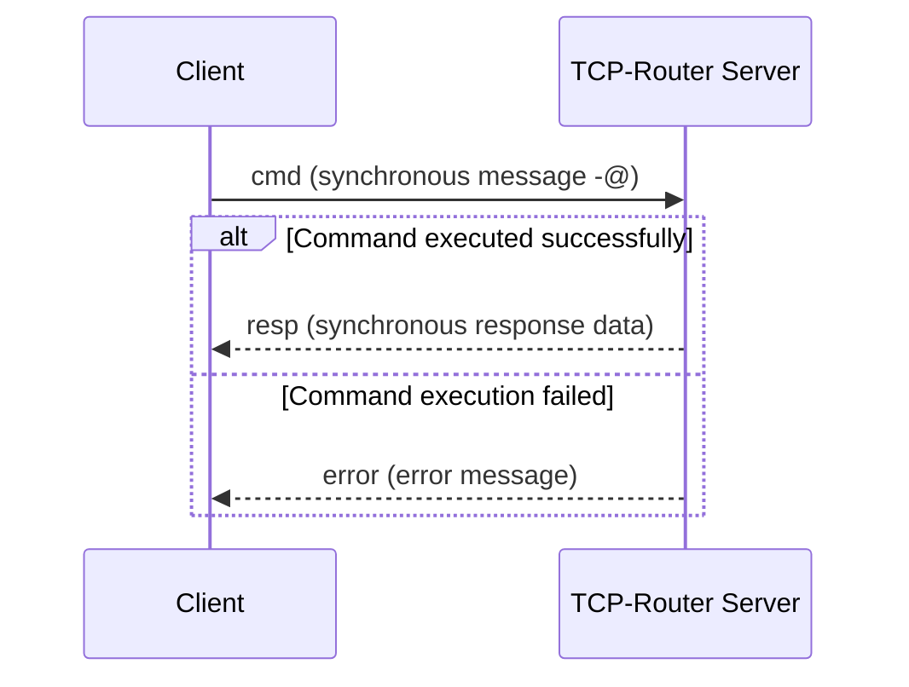
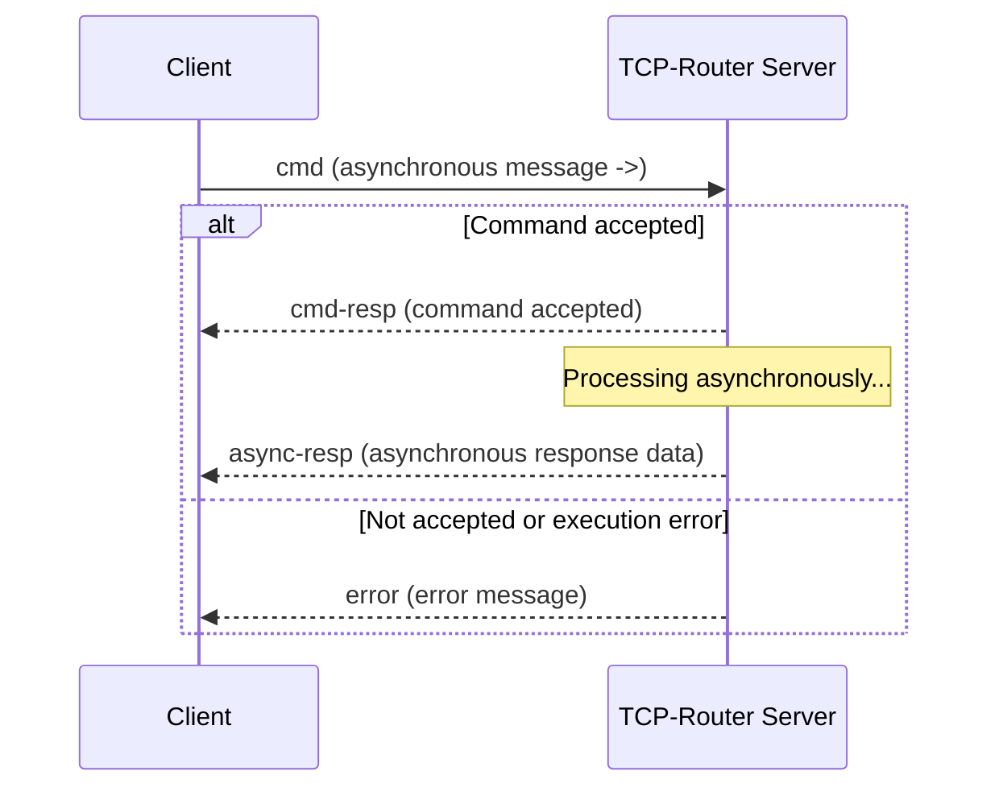
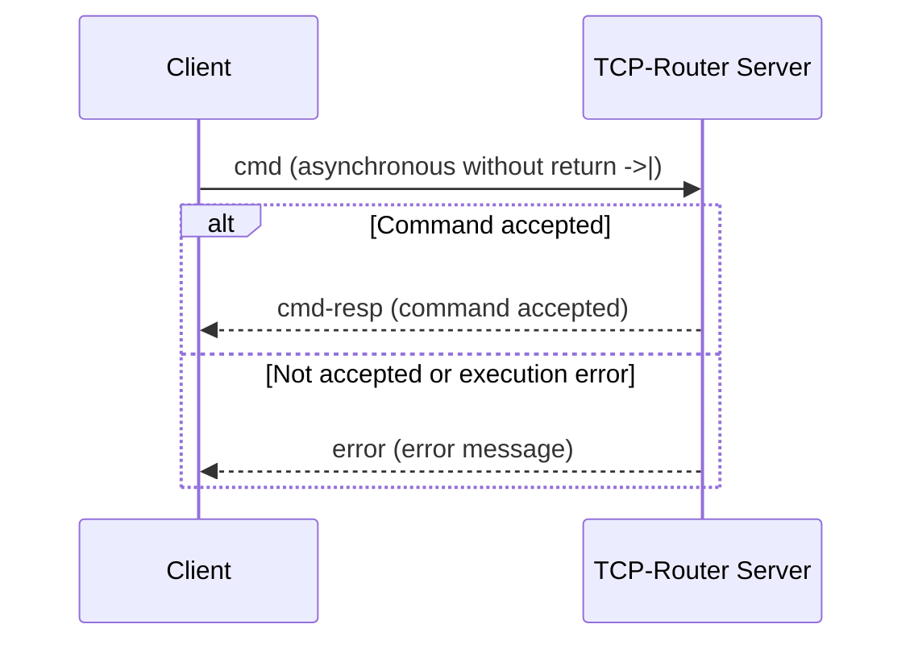
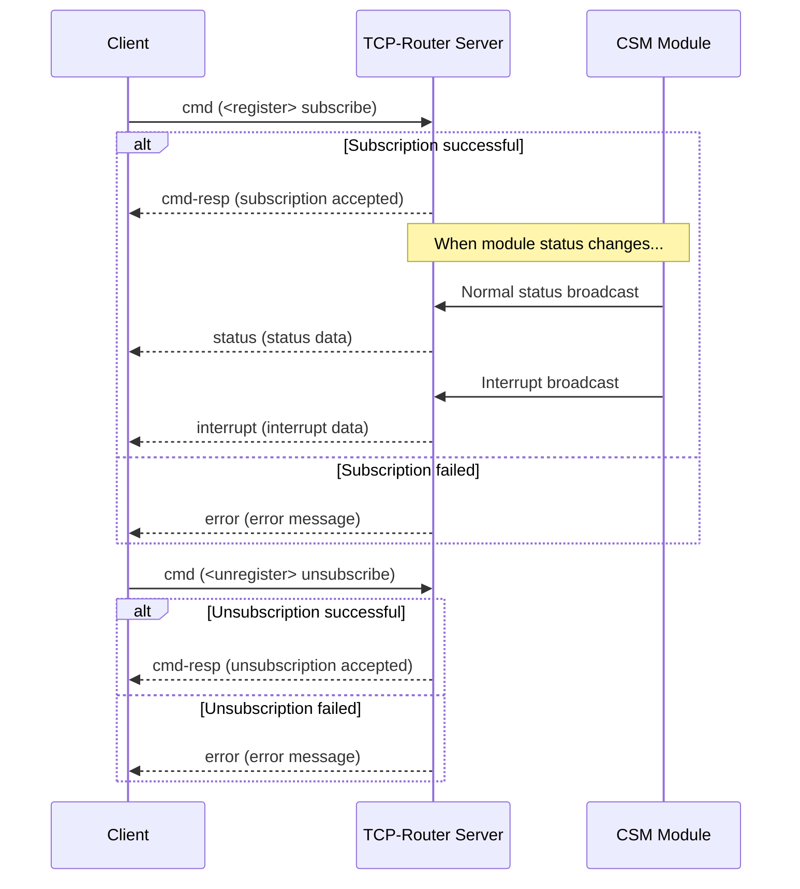

# Protocol Definition

The TCP packet format used in the CSM-TCP-Router is defined as follows:

``` txt
| Data Length (4B) | Version (1B) | TYPE (1B) | FLAG1 (1B) | FLAG2 (1B) |      Text Data          |
╰─────────────────────── Header (8B)      ──────────────────────────────╯╰─── Data Length Range ──╯
```

## Header Fields

### Data Length (4 Bytes)

This field specifies the length of the data section and is represented using 4 bytes.

### Version (1 Byte)

This field indicates the version of the data packet. The current version is `0x01`. Different versions can be handled appropriately to ensure forward compatibility.

### Packet Type (1 Byte)

This field defines the type of the data packet and is an enumerated value. The supported packet types are:

- Information Packet (`info`) - `0x00`
- Error Packet (`error`) - `0x01`
- Command Packet (`cmd`) - `0x02`
- Command Response Packet (`cmd-resp`) - `0x03`
- Synchronous Response Packet (`resp`) - `0x04`
- Asynchronous Response Packet (`async-resp`) - `0x05`
- Subscription Normal Broadcast Packet (`status`) - `0x06`
- Subscription Interrupt Broadcast Packet (`interrupt`) - `0x07`

### FLAG1 (1 Byte)

This field is reserved for future use to describe additional attributes of the data packet.

### FLAG2 (1 Byte)

Similar to FLAG1, this field is reserved for future use to describe additional attributes of the data packet.

## Data Content

### Information Packet (`info`)

The content of an information packet is plain text containing informational data.

The server sends an `info` packet to the client in two specific situations:

- **On Connection**: When a client successfully connects to the server, the server sends a welcome `info` packet:

  ```
  Welcome to the CSM TCP Router Server
  API: "list", "list api", "list states", "help"
  type "bye" to close connection from Server side.
  ```

- **On Disconnection**: When the connection is closed from the server side, the server sends a goodbye `info` packet:

  ```
  Good bye.
  ```

### Error Packet (`error`)

The content of an error packet is plain text describing an error, formatted as per the CSM Error format.

> [!NOTE]
> The CSM Error format is: `[Error: Error Code] Error Message`.

### Command Packet (`cmd`)

The content of a command packet is a command in the CSM local command format. It supports the following types of messages:

- Synchronous (`-@`)
- Asynchronous (`->`)
- Asynchronous without return (`->|`)
- Register (`register`)
- Unregister (`unregister`)

> [!NOTE]
> Example: Suppose there is a CSM module named `DAQmx` in the local program with an interface `API: Start Sampling`. You can send the following messages to control data acquisition:
>
> ``` c++
> API: Start Sampling -@ DAQmx // Synchronous message
> API: Start Sampling -> DAQmx // Asynchronous message
> API: Start Sampling ->| DAQmx // Asynchronous message without return
> ```
>
> These messages can also be sent over a TCP connection to achieve remote control.

> [!NOTE]
> Example: Suppose there is a CSM module `A` that continuously sends a monitoring status called `Status`. Another module `B` can subscribe to this status:
>
> ``` c++
> status@a >> api@b -><register> // Subscribe to status
> status@a >> api@b -><unregister> // Unsubscribe from status
> ```
>
> Similarly, these messages can be sent over a TCP connection to manage subscriptions remotely.
>
> If the subscriber (`api@b`) is omitted, it indicates that the client connected to the TCP router is subscribing to the status:
>
> ``` c++
> status@a -><register> // Client subscribes to module A's status
> status@a >> api@b -><unregister> // Client unsubscribes from module A's status
> ```
>
> When module `A` sends a `Status`, the client will automatically receive a `status` packet.

### Command Response Packet (`cmd-resp`)

Except for synchronous messages (`-@`), all other command packets (`cmd`) receive a handshake response after being received and processed by the server:

- **Normal case**: A `cmd-resp` packet is returned, indicating the command has been accepted and triggered for execution.
- **Error case**: An `error` packet is returned, indicating the command was not accepted or an error occurred during execution (e.g., the target module does not exist, execution failed, etc.).

> [!NOTE]
> `cmd-resp` is a handshake acknowledgment of the command, indicating that the command has been accepted and execution has started. It does not contain business response data.
> Business response data is returned via `resp` or `async-resp` packets.
>
> Synchronous messages (`-@`) do not have a `cmd-resp` handshake; upon completion, they directly return `resp` or `error`.
>

### Synchronous Response Packet (`resp`)

After executing a synchronous command, the TCP router sends a response packet back to the client.

### Asynchronous Response Packet (`async-resp`)

After executing an asynchronous command, the TCP router sends a response packet back to the client. The format is: `Response Data <- Original Asynchronous Message`.

### Subscription Status Packet (`status`)

When a client subscribes to the status of a CSM module, it will automatically receive this packet whenever the status changes.

The packet format is: `Status Name >> Status Data <- Sending Module`.

## Communication Flow

### Synchronous Message Flow (`-@`)

After the client sends a synchronous command, it **must wait** for the server to return a response: either a `resp` (synchronous response data) or an `error` (error message). Synchronous messages do not have a `cmd-resp` handshake packet.



### Asynchronous Message Flow (`->`)

After the client sends an asynchronous command, the server first returns a confirmation packet: either `cmd-resp` (command accepted) or `error` (command not accepted or execution error). Upon receiving `cmd-resp`, the client **does not need to wait** for the business response and can continue sending other commands; after asynchronous processing is complete, the server returns an `async-resp` packet.



### Asynchronous Without Return Flow (`->|`)

After the client sends an asynchronous without return command, the server first returns a confirmation packet: either `cmd-resp` (command accepted) or `error` (command not accepted or execution error). Once the command is accepted, **no** business response packet will be returned after processing is complete.



### Subscribe/Unsubscribe Flow (`<register>` / `<unregister>`)

After the client sends a subscribe or unsubscribe command, the server returns a `cmd-resp` handshake confirmation. Once subscribed, whenever the subscribed module emits a status, the client continuously receives `status` packets (normal broadcast) or `interrupt` packets (interrupt broadcast), until unsubscribed.

> [!NOTE]
> Both `status` and `interrupt` subscription broadcast types are supported:
> - `status` (`0x06`): Normal broadcast, subscribes to regular status changes of the module
> - `interrupt` (`0x07`): Interrupt broadcast, subscribes to interrupt events triggered by the module
>


