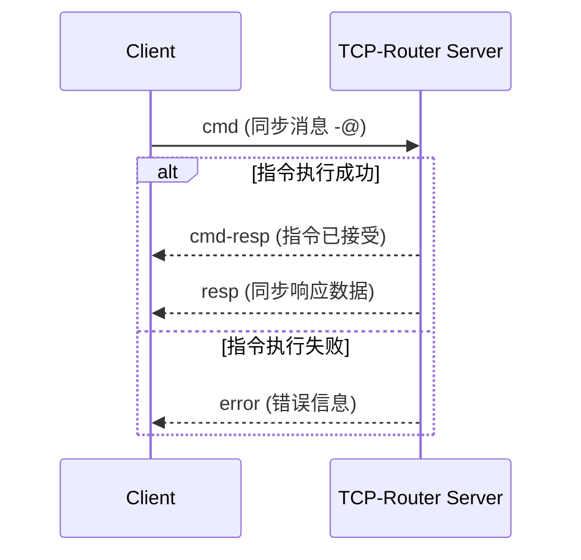
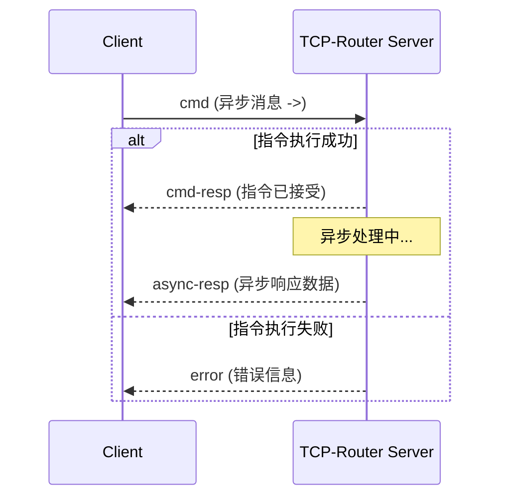
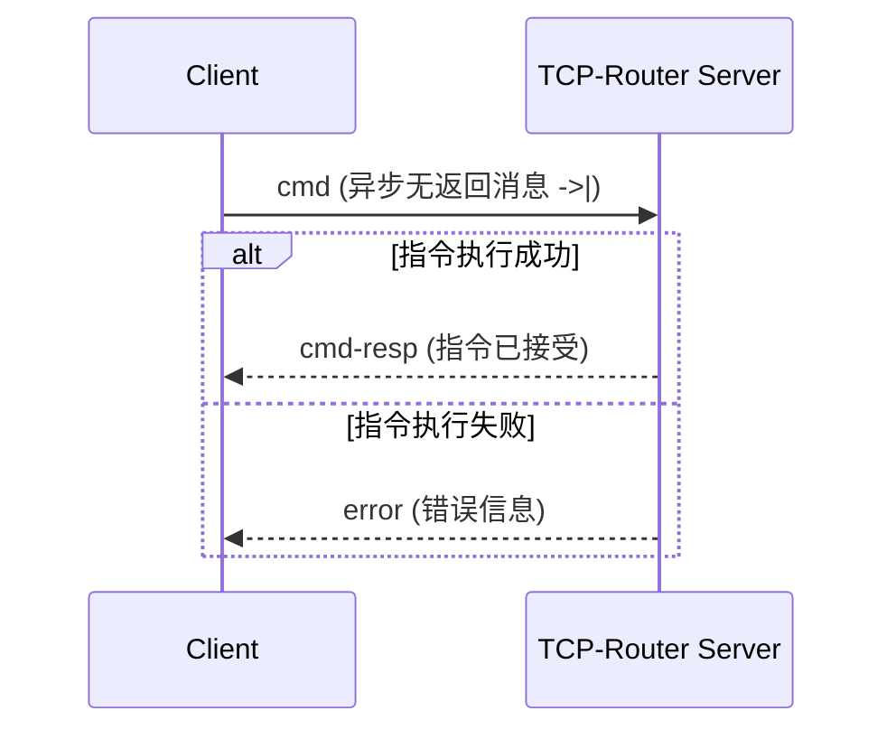
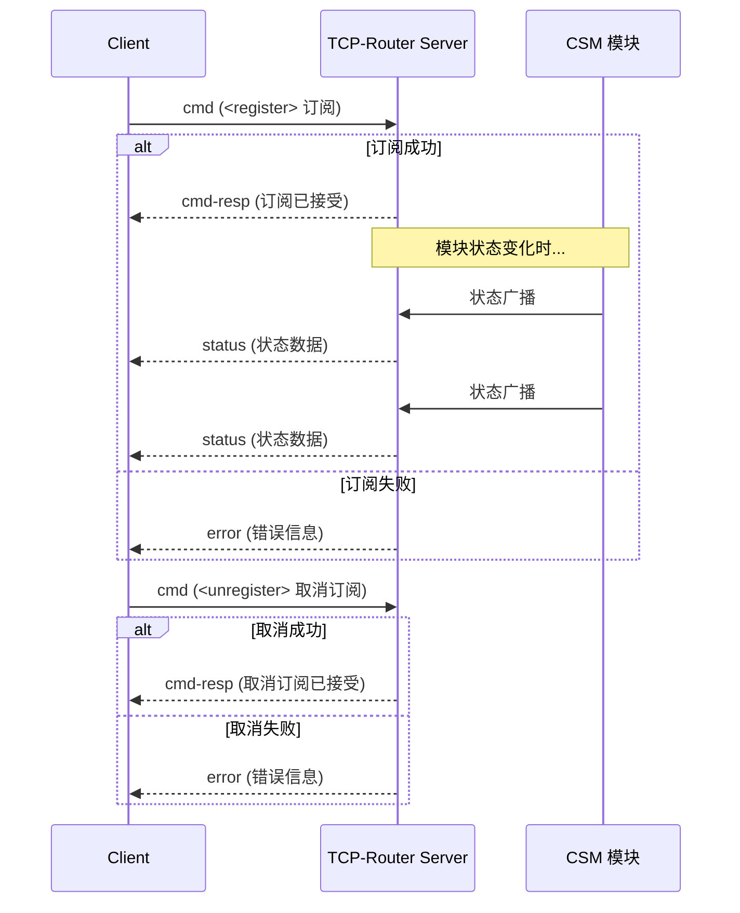

# 传输协议

CSM-TCP-Router 中 TCP 数据包格式定义如下：

``` txt
| 数据长度(4B) | 版本(1B) | TYPE(1B) | FLAG1(1B) | FLAG2(1B) |      文本数据          |
╰─────────────────────────── 包头 ──────────────────────────╯╰──── 数据长度字范围 ────╯
```

## 包头字段

### 数据长度(4字节)

数据长度为4字节，表示数据字段的长度。

### 版本信息(1字节)

版本信息为1字节，表示数据包的版本信息。当前的版本信息为 `0x01`。可以根据版本信息进行不同的处理，实现向前兼容。

### 数据包类型(1字节)

数据包类型用于描述数据包的内容，为枚举类型，目前支持的数据包类型有：

- 信息数据包(info) - `0x00`
- 错误数据包(error) - `0x01`
- 指令数据包(cmd) - `0x02`
- 指令响应数据包(cmd-resp) - `0x03`
- 同步响应数据包(resp) - `[待确认]`
- 异步响应数据包(async-resp) - `0x04`
- 订阅普通广播返回数据包(status) - `0x05`
- 订阅中断广播返回数据包(interrupt) - `0x06`

### FLAG1类型(1字节)

FLAG1用于描述数据包的属性, 保留字段。

### FLAG2类型(1字节)

FLAG2用于描述数据包的属性, 保留字段。

## 数据内容

### 信息数据包(info)

info 数据包的数据内容为提示信息内容，纯文本格式。

### 错误数据包(error)

error 数据包的数据内容为错误信息内容，为纯文本格式，文本格式定为 CSM Error 格式。

> [!NOTE]
> CSM Error 格式为："[Error: `错误代码`]`错误字符串`"。
>

### 指令数据包(cmd)

指令数据包的数据内容为指令内容，格式为 CSM 本地指令格式，支持：

- 同步(-@)
- 异步(->)
- 无返回异步(->|)消息，
- 注册(register)
- 注销(unregister)。

> [!NOTE]
> 举例：假设本地程序存在名为DAQmx的CSM模块，具有一个接口为 "API: Start Sampling".
> 本地我们可以发送消息给这个模块，控制采集的启停：
>
> ``` c++
> API: Start Sampling -@ DAQmx // 同步消息
> API: Start Sampling -> DAQmx // 异步消息
> API: Start Sampling ->| DAQmx // 异步无返回消息
> ```
>
> 现在只要通过TCP连接，发送同样的文本消息，就可以实现远程消息。
>

> [!NOTE]
> 举例：假设本地程序存在名为A的CSM模块，不停的发送一个监控状态为 "Status", 另外一个模块B可以订阅这个状态。
>
> ``` c++
> status@a >> api@b -><register> // 订阅状态
> status@a >> api@b -><unregister> // 取消订阅
> ```
>
> 现在只要通过TCP连接，发送同样的文本消息，就可以实现远程控制底层 csm 模块的订阅
>
> 但是如果发送中缺省了订阅方(api@b), 则表示连接到 tcp-router 的 client订阅状态
>
> ``` c++
> status@a -><register> // client 订阅 A 模块status
> status@a >> api@b -><unregister> // 取消 client 订阅 A 模块status
> ```
>
> 当 A 模块发出 Status 后，client 将自动收到 `status` 数据包
>

### 指令响应数据包(cmd-resp)

所有的指令数据包(cmd)在被服务端接收并处理后，都会有一个握手返回：

- **正常情况**：返回 `cmd-resp` 数据包，表示指令已被接受并触发执行。
- **错误情况**：返回 `error` 数据包，表示指令执行出现错误。

> [!NOTE]
> `cmd-resp` 是对指令的握手确认，表示指令已被接受并开始执行，不包含业务响应数据。
> 业务响应数据由 `resp` 或 `async-resp` 数据包返回。
>

### 同步响应数据包(resp)

当执行完毕同步消息指令后，tcp-router 将 response 返回给 client.

### 异步响应数据包(async-resp)

当执行完毕异步消息指令后，tcp-router 将 response 返回给 client. 格式为："`Response数据` <- `异步消息原文`"

### 订阅返回数据包(status)

Client 订阅了CSM模块的状态，当状态发生时，client 会自动收到此数据包。

数据包格式为 "状态名 >> `状态数据` <- 发送模块"

## 通信流程

### 同步消息流程 (`-@`)

客户端发送同步指令后，**必须等待**服务端依次返回 `cmd-resp`（握手确认）和 `resp`（同步业务响应数据）后，才算完成一次完整交互。若指令执行出错，则仅返回 `error` 数据包。



### 异步消息流程 (`->`)

客户端发送异步指令后，服务端立即返回 `cmd-resp` 握手确认。客户端**无需等待**业务响应，可继续发送其他指令。业务处理完成后，服务端异步返回 `async-resp` 数据包。若指令执行出错，则仅返回 `error` 数据包。



### 异步无返回消息流程 (`->|`)

客户端发送异步无返回指令后，服务端立即返回 `cmd-resp` 握手确认。业务处理完成后**不会**返回业务响应数据包。若指令执行出错，则返回 `error` 数据包。



### 订阅/注销流程 (`<register>` / `<unregister>`)

客户端发送订阅或注销指令后，服务端返回 `cmd-resp` 握手确认。订阅成功后，每当被订阅模块发出状态，客户端会持续收到 `status` 数据包，直到取消订阅。


