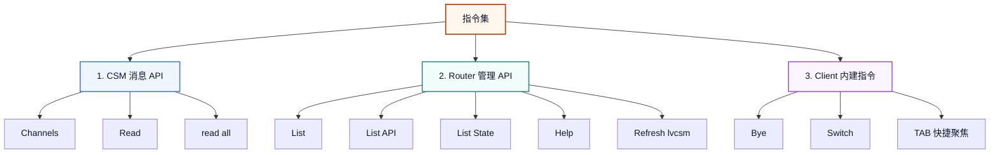
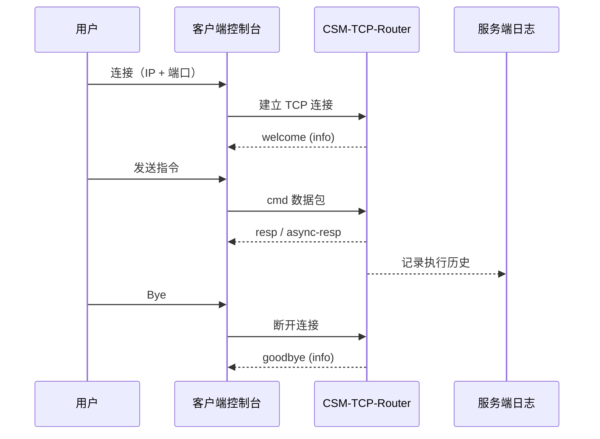

# CSM-TCP-Router

[English](./README.md) | [中文](./README(zh-cn).md)

CSM-TCP-Router 是一个可复用的 CSM TCP 通讯层。  
它通过 CSM 隐形总线机制，将本地 CSM 程序转换为可远程控制的 TCP 服务器。

## 功能特性


- 所有本地可发送的 CSM 消息都可通过 TCP 以同步或异步格式转发。
- 基于 JKI TCP Server，支持多个客户端并发连接。
- 仓库内置标准客户端，可用于连接与指令联调验证。

## 通讯协议

TCP 数据包格式如下：

```
| 数据长度(4B) | 版本(1B) | TYPE(1B) | FLAG1(1B) | FLAG2(1B) |      文本数据      |
╰─────────────────────────── 包头 ───────────────────────────╯╰──── 数据长度范围 ────╯
```

`TYPE` 字段当前支持：

- `info` (`0x00`)：客户端连接（欢迎）和断开（告别）时发送
- `error` (`0x01`)
- `cmd` (`0x02`)
- `cmd-resp` (`0x03`)
- `resp` (`0x04`)
- `async-resp` (`0x05`)
- `status` (`0x06`)
- `interrupt` (`0x07`)

完整协议请见 [协议设计](.doc/Protocol.v0.(zh-cn).md)。

## 指令集



### 1）CSM 消息 API

由现有 CSM 业务代码定义，可经 Router 直接转发，无需侵入式改造。

### 2）Router 管理 API

由 CSM-TCP-Router 定义，用于模块管理与运行态查询。

### 3）Client 内建指令（仅客户端）

由内置客户端提供，不属于二次开发时可扩展的指令集 API。



## 使用方法

1. 在 VIPM 中安装本工具及依赖。
2. 在 CSM 范例中打开 `CSM-TCP-Router.lvproj`。
3. 启动 `CSM-TCP-Router(Server).vi`。
4. 启动 `Client.vi`，输入服务端 IP 和端口并连接。
5. 发送指令，在客户端控制台查看返回消息。
6. 在服务端日志界面查看历史执行记录。
7. 在 `Client.vi` 中输入 `Bye` 断开连接。
8. 关闭服务端程序。

### 下载

在 VIPM 中搜索 `CSM TCP Router` 并安装。

### 依赖

- Communicable State Machine (CSM) - NEVSTOP
- JKI TCP Server - JKI
- Global Stop - NEVSTOP
- OpenG
