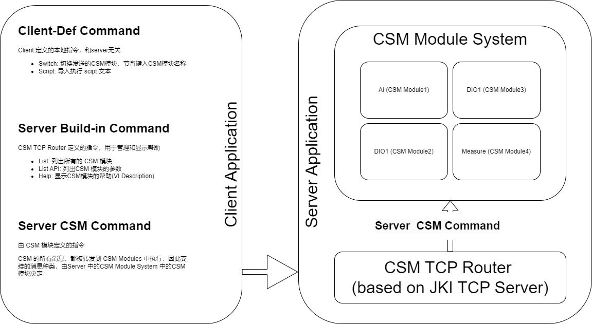

# CSM-TCP-Router

[English](./README.md) | [中文](./README(zh-cn).md)

Application Example to show how to setup a TCP Server and Client using CSM and JKI TCP Server.

**CSM-TCP-Router Server**

**CSM-TCP-Router Client**

Deps:

 - JKI TCP Server - JKI
 - Communicable State Machine(CSM) - NEVSTOP
 - Global Stop - NEVSTOP
 - OpenG
