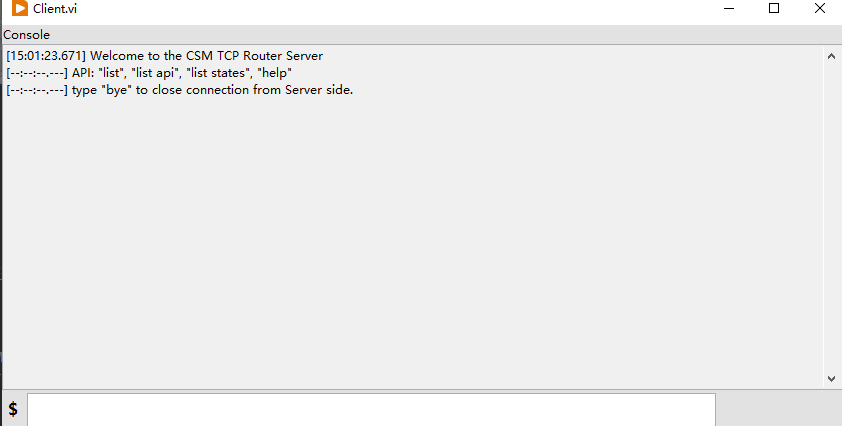

# CSM-TCP-Router

[English](./README.md) | [中文](./README(zh-cn).md)

This repository demonstrates how to create a reusable TCP communication layer (CSM-TCP-Router) to turn a local program into a TCP server for remote control. This example showcases the advantages of the CSM framework's invisible bus.

## Features


- All CSM messages that can be sent locally can be transmitted to the local program via TCP connection using CSM synchronous and asynchronous message formats.
- Based on the JKI-TCP-Server library, it supports multiple TCP clients connecting simultaneously.
- [client] Provides a standard TCP client that can connect to the server to verify remote connections and message sending.

## Protocol

The TCP packet format used in the CSM-TCP-Router is defined as follows:

```
| Data Length (4B) | Version (1B) | TYPE (1B) | FLAG1 (1B) | FLAG2 (1B) |      Text Data          |
╰───────────────────────────────── Header ──────────────────────────────╯╰─── Data Length Range ──╯
```

This field defines the type of the data packet and is an enumerated value. The supported packet types are:

- Information Packet (`info`) - `0x00`
- Error Packet (`error`) - `0x01`
- Command Packet (`cmd`) - `0x02`
- Synchronous Response Packet (`resp`) - `0x03`
- Asynchronous Response Packet (`async-resp`) - `0x04`
- Subscription Status Packet (`status`) - `0x05`

For detailed communication protocol definitions, see [Protocol Design](/Protocol%20Design.v0.(en).md).

## Supported Command Sets


### 1. CSM Message Command Set

Defined by the original code developed based on CSM. Since the CSM framework transmits messages through an invisible bus, all communication can be implemented without intrusive code changes.

For example, the AI CSM module in this program provides:

- `Channels`: List all channels
- `Read`: Read the value of a specified channel
- `read all`: Read the values of all channels

These messages can be sent to the local program via TCP connection for remote control.

### 2. CSM-TCP-Router Command Set

Defined by the TCP communication layer (CSM-TCP-Router). The functions managed by the CSM module can be remotely controlled by defining commands.

- `List`: List all CSM modules
- `List API`: List all APIs of a specified module
- `List State`: List all CSM states of a specified module
- `Help`: Display the help file of the module, stored in the Documentation field of the CSM VI
- `Refresh lvcsm`: Refresh the cache file

### [Client Only] 3. CSM-TCP-Router Client Command Set

A standard CSM-TCP-Router Client is provided in the code. It also has some built-in commands that cannot be used if developed based on the command set.

- `Bye`: Disconnect
- `Switch`: Switch modules to omit the module name when inputting commands; switches back to default mode if no parameter is provided
- TAB key: Automatically focus on the input dialog box



## Usage

1. Install this tool and dependencies via VIPM
2. Open the example project CSM-TCP-Router.lvproj in the CSM examples
3. Start the CSM-TCP-Router(Server).vi in the code project
4. Start Client.vi, enter the server's IP address and port number, and click connect
5. Enter commands and click send to see the returned messages in the console
6. View the history of executed messages in the log interface of the Server program
7. Enter `Bye` in Client.vi to disconnect
8. Close the Server program

### Download

Search for CSM TCP Router in VIPM to download and install.

### Dependencies

- Communicable State Machine (CSM) - NEVSTOP
- JKI TCP Server - JKI
- Global Stop - NEVSTOP
- OpenG
