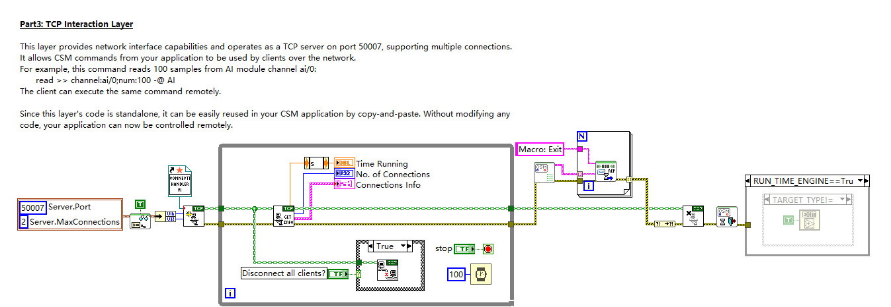
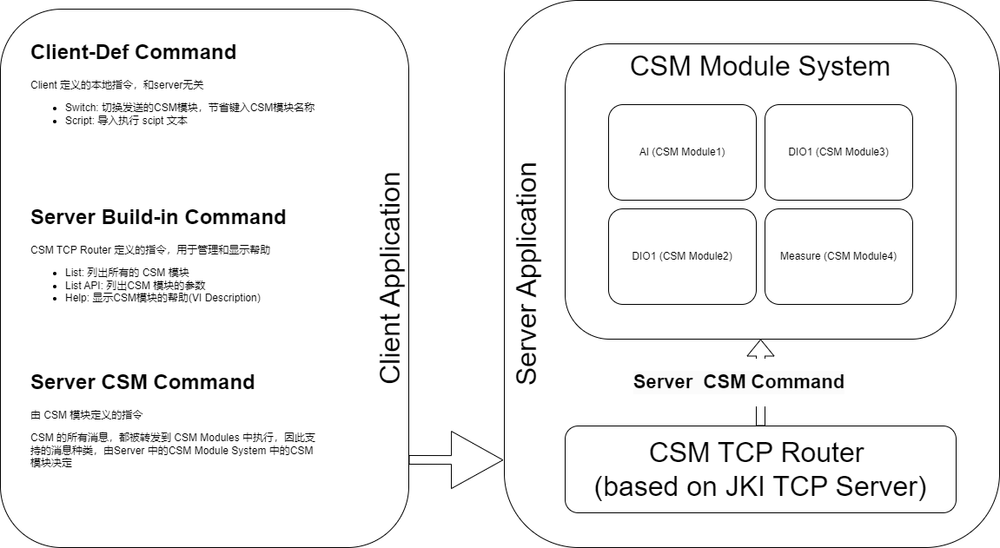
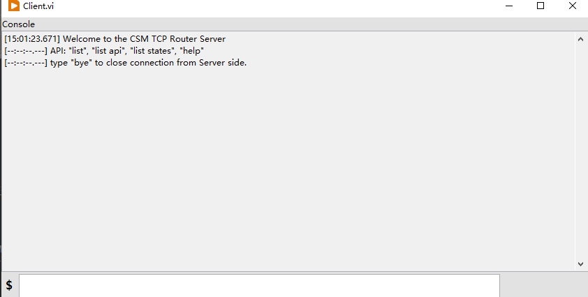

# CSM-TCP-Router

[English](./README.md) | [中文](./README(zh-cn).md)

CSM-TCP-Router is a reusable TCP communication layer for CSM applications.  
It turns a local CSM program into a remotely controllable TCP server through the CSM invisible bus mechanism.

## Features



Excalidraw source files for the diagrams are in `.doc/*.excalidraw`.

- Any CSM message available locally can be forwarded through TCP in synchronous or asynchronous format.
- Based on JKI TCP Server, it supports multiple concurrent client connections.
- The repository includes a standard client for connection and command verification.

## Protocol

TCP packet format:

```
| Data Length (4B) | Version (1B) | TYPE (1B) | FLAG1 (1B) | FLAG2 (1B) |      Text Data      |
╰──────────────────────────── Header ────────────────────────────╯╰─ Data Length Range ─╯
```

Supported packet `TYPE` values:

- `info` (`0x00`): sent on connect (welcome) and disconnect (goodbye)
- `error` (`0x01`)
- `cmd` (`0x02`)
- `cmd-resp` (`0x03`)
- `resp` (`0x04`)
- `async-resp` (`0x05`)
- `status` (`0x06`)
- `interrupt` (`0x07`)

See [Protocol Design](.doc/Protocol.v0.(en).md) for full details.

## Command Sets



### 1) CSM Message APIs

Defined by existing CSM-based application code and forwarded through the router without intrusive changes.

### 2) Router Management APIs

Defined by CSM-TCP-Router for module management and runtime inspection.

### 3) Client Built-ins (Client only)

Built into the bundled client and not available through secondary API development.



## Usage

1. Install this package and dependencies in VIPM.
2. Open `CSM-TCP-Router.lvproj` from CSM examples.
3. Run `CSM-TCP-Router(Server).vi`.
4. Run `Client.vi`, enter server IP/port, and connect.
5. Send commands and check returned messages in the client console.
6. Check execution history in the server log panel.
7. Enter `Bye` in `Client.vi` to disconnect.
8. Stop the server.

### Download

Search `CSM TCP Router` in VIPM and install.

### Dependencies

- Communicable State Machine (CSM) - NEVSTOP
- JKI TCP Server - JKI
- Global Stop - NEVSTOP
- OpenG
